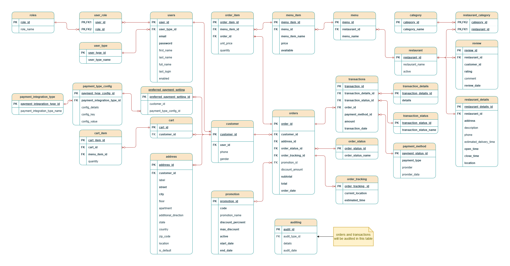

# Elmenus Lite

## Project Overview

**Elmenus Lite** is a backend service for a restaurant menu and cart management system. It provides RESTful APIs for managing customers, carts, menu items, orders, and related entities. The project is built using an API-first approach, leveraging **OpenAPI** for documentation

---

## Technology Stack

| Layer/Component      | Technology/Tool                |
|----------------------|--------------------------------|
| **Language**         | Java 17+                       |
| **Framework**        | Spring Boot                    |
| **Build Tool**       | Maven                          |
| **API Documentation**| OpenAPI                        |
| **Database**         | PostgreSQL (with PostGIS)      |
| **ORM**              | Spring Data JPA (Hibernate)    |
| **Containerization** | Docker, Docker Compose         |
| **Mapping**          | MapStruct                      |

---

## Architecture Overview

### Monolithic Spring Boot Application

**Layered Architecture:**

- **Controller Layer**: Exposes RESTful endpoints, handles HTTP requests/responses.
- **Service Layer**: Contains business logic, transaction management.
- **Repository Layer**: Data access using Spring Data JPA.
- **Model/Entity Layer**: JPA entities representing domain objects.
- **DTO/Mapper Layer**: Data Transfer Objects and MapStruct mappers for API payloads.
- **Exception Handling**: Centralized via `@ControllerAdvice`.


### File Structure
```
├── src/
│   ├── main/
│   │   ├── java/
│   │   │   └── spring/
│   │   │       └── practice/
│   │   │           └── elmenus_lite/
│   │   │               ├── config/
│   │   │               ├── controller/
│   │   │               ├── dto/
│   │   │               ├── exception/
│   │   │               ├── mapper/
│   │   │               ├── model/
│   │   │               ├── repository/
│   │   │               ├── service/
│   │   │               └── ElmenusLiteApplication.java
│   │   └── resources/
│   │       ├── db/
│   │       └── application.yml
```
---

## API-First Approach

- **OpenAPI Specification** is used to define and document all REST endpoints.
- [Cart Management](openapi/CartManagement.yml)
---

## Features

### 1. Cart Management

- **API Endpoints**: Add to cart, modify item, view cart, clear cart, remove item, checkout, update quantity
- **Database Tables**: `Cart`, `Cart Items`

### 2. User Registration & Authentication

- **API Endpoints**: Sign up, login, logout, reset password, email/SMS verification, user/customer profile, social auth, enable/disable account
- **Database Tables**: `Customer`, `Restaurant`, `User`, `Role`, `User Type`
- **Access Management**: Role-based access, session management

### 3. Restaurant & Menu Management

- **API Endpoints**: Register/update/enable/disable/view restaurant, create/update/delete/enable/disable menu, view history of menu , top rating restaurants , restaurants recommendations
- **Database Tables**: `Menu`, `Menu Item`, `Restaurant`, `Restaurant Details`

### 4. Order Management

- **API Endpoints**: Place/update/cancel order, order history, order summary, order status, notifications
- **Database Tables**: `Order`, `Order Item`, `Order Status`, `Order Tracking`
- **Notifications**: Email/SMS/push notifications to customer [Order Confirmation]

### 5. Customer Management

- **API Endpoints**: Customer order history, address management, reviews, support, chat, payment integration
- **Database Tables**: `Customer`, `Address`, `Review`
- **Chat Support**: `Chat Integration`

### 6. Payment Integration : with 3rd Party

- **API Endpoints**: Transaction receipt, transaction details, payment integration, auditing, payment status
- **Database Tables**: `Transaction`, `Transaction Details`, `Payment Integration`, `Payment Status`
- **Auditing & Validation**: Auditing payment integration, payment notification/validation

### 7. Dashboard & Reports

- **API Endpoints**: System and restaurant analytics, order/payment statistics, customer counts, daily/monthly reports
- **Database Tables**: `System`, `Reports`, `Restaurant`

---

## Database Design

- **Database**: PostgreSQL
- **Extension**: PostGIS for geospatial queries (e.g., restaurant locations)
- **Migration Tool**: Liquibase (via XML changelogs) for migrations and versioning
### ERD

---
